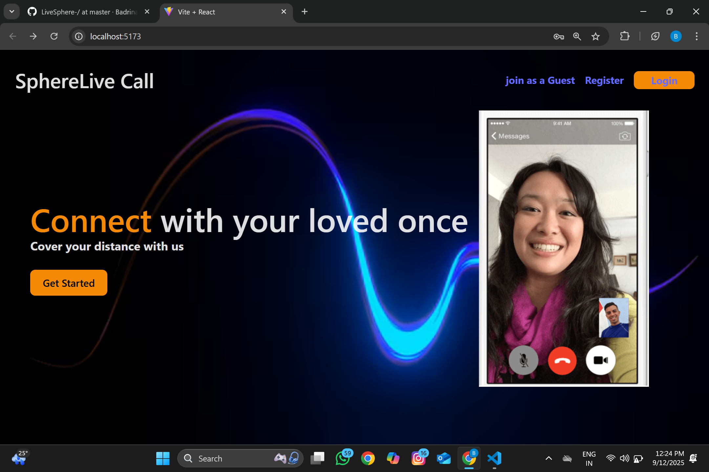
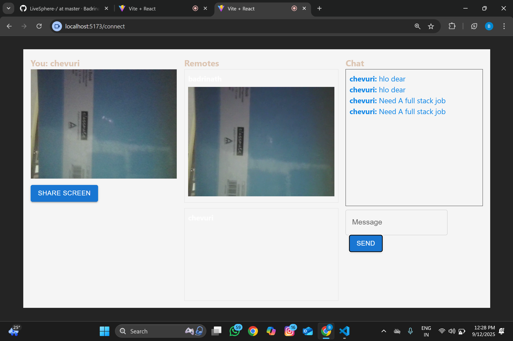
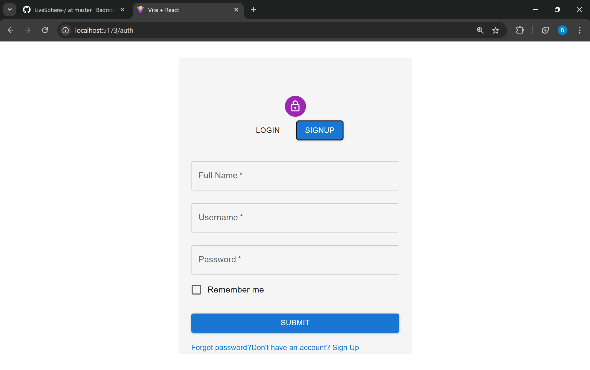
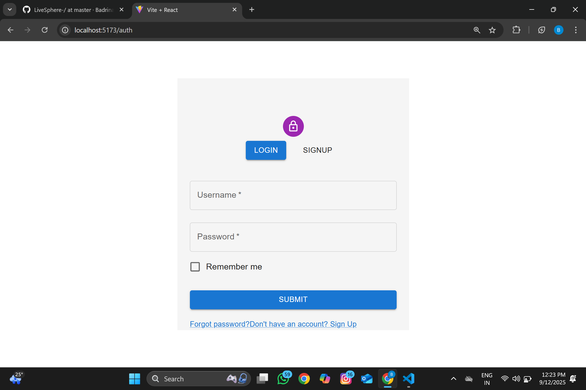

# LiveSphere 🎥🌐  
[](LICENSE)  
[](https://github.com/your-username/livesphere/actions)  
[](#-contributing)  

A modern, high-performance video calling application designed for seamless real-time communication. LiveSphere empowers users to connect, collaborate, and share experiences with crystal-clear video, low-latency audio, and interactive features.  

---

## ✨ Features  
- 🔗 **One-click Meetings** – Generate and join video calls instantly with shareable links.  
- 📹 **High-Quality Video & Audio** – Adaptive streaming ensures smooth performance on any device.  
- 🧑‍🤝‍🧑 **Multi-Participant Calls** – Supports group video conferences with screen layouts.  
- 🖥 **Screen Sharing** – Present your screen or a specific window in real time.  
- 💬 **In-Call Chat** – Text chat alongside video and audio.  
- 🔒 **End-to-End Encryption** – Built with security and privacy at its core.  
- 📱 **Cross-Platform** – Works on desktop, mobile, and tablets with responsive design.  

---

## 🚀 Tech Stack  
- **Frontend**: React (Next.js) + Tailwind CSS  
- **Backend**: Node.js + Express  
- **Real-Time Communication**: WebRTC + Socket.IO  
- **Database**: MongoDB / PostgreSQL (configurable)  
- **Deployment**: Docker + GitHub Actions  
- **Authentication**: JWT / OAuth2  
---
## ✨ Live Link
https://livesphere-frontend.onrender.com
---
##Screenshots
---
  

  

  

  


## 📦 Installation & Setup  

Clone the repository:  
```bash
git clone https://github.com/your-username/livesphere.git
cd livesphere
